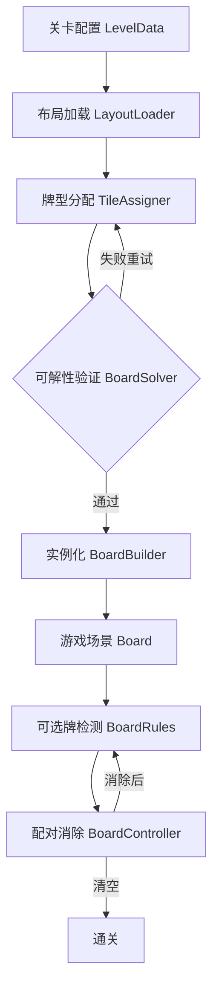

# Vita Mahjong 总体设计方案

> Godot 4.6 · 2D 竖屏 · Shanghai 麻将消除  
> 本文档为项目级总设计，各阶段细节见 `changes/archive/` 与 `specs/`。

## 1. 项目概述

Vita Mahjong 是一款类似 Vita/Tile Club 的麻将配对消除游戏。玩家在层叠的麻将牌中，点击两张**可选且同牌型**的牌进行消除，直到清空牌盘。

- **分辨率**: 720 × 1080 竖屏
- **牌尺寸**: 73 × 102 px（白模阶段使用 ColorRect + Label）
- **核心规则**: 上方无遮挡 + 左右至少一侧空闲 → 可选；同牌型配对消除

---

## 2. 整体架构



三层分离：

| 层级 | 职责 | 关键模块 |
|------|------|----------|
| **数据层** | 牌型、布局、关卡配置 | `TileType`, `TileRegistry`, `CellData`, `LayoutLoader` |
| **生成层** | 坐标转换、洗牌、求解、建盘 | `GridConverter`, `TileAssigner`, `BoardSolver`, `BoardBuilder` |
| **表现层** | 牌面渲染、交互、状态 | `MahjongTile`, `BoardController`, `BoardRules` |

---

## 3. 数据模型

### 3.1 牌型 `TileType`

```
Category: WAN | TIAO | BING | WIND | DRAGON | FLOWER | SEASON
字段: id, display_name, category
查询: TileRegistry.get_tile("wan_1")
```

共 34 种基础牌（万/条/饼 1-9，东南西北，中发白）。

### 3.2 布局格 `CellData`

```gdscript
var x: int      # 逻辑网格横坐标（×2 精度）
var y: int      # 逻辑网格纵坐标
var layer: int  # 层数，0 = 底层
```

### 3.3 布局模板 JSON

```json
{
  "name": "demo_12",
  "cells": [
    {"x": 0, "y": 4, "layer": 0},
    {"x": 1, "y": 3, "layer": 1}
  ]
}
```

布局只描述位置，**不包含牌型**（与牌型分配分离）。

### 3.4 关卡配置 `LevelData`（P4 规划）

```gdscript
var level_id: int
var layout_path: String       # res://Data/Layouts/xxx.json
var tile_pool: Array[String]  # 本关可用牌型池
var difficulty: int
```

### 3.5 求解槽位 `TileSlot`

```gdscript
var cell: CellData
var tile_id: String
```

供 `BoardRules` 与 `BoardSolver` 共用，与场景节点解耦。

---

## 4. 坐标系统

### 4.1 逻辑网格（×2 整数）

- 牌宽 = **2 格**，牌高 = **3 格**
- 偶数 x → 整格对齐；奇数 x → 半格偏移（经典叠层效果）

### 4.2 像素转换

```
world_x = origin_x + grid_x * (TILE_SIZE.x / 2)
world_y = origin_y + grid_y * GRID_Y_STEP        # 当前 22px，层间重叠
z_index = layer * 1000 + grid_y
position += LAYER_OFFSET * layer                 # 每层 (-4, -10) 视觉抬升
```

### 4.3 居中

`BoardBuilder` 计算所有牌的包围盒，将牌盘中心对齐视口中心。

---

## 5. 生成流程

```
1. LayoutLoader.load(path)        → Array[CellData]
2. TileAssigner.assign_solvable() → Array[tile_id]（随机洗牌 + 可解验证）
3. BoardBuilder.build()           → 实例化 MahjongTile，setup + position + z_index
4. BoardController.initialize()   → 注册交互
```

### 5.1 牌型分配

- 统计格数 N（必须为偶数）
- 生成 N/2 对牌型，shuffle 后填入 cells
- `BoardSolver` DFS 验证可解，最多重试 200 次

### 5.2 布局来源（优先级）

| 方式 | 状态 | 说明 |
|------|------|------|
| **预设模板** | ✅ 已实现 | `Data/Layouts/*.json` |
| **参数化生成** | 🔲 P4+ | 按层数/宽高随机填空 |
| **经典龟形等** | 🔲 P4+ | 更多模板库 |

---

## 6. 玩法规则

### 6.1 可选牌判定 `BoardRules`

牌可选当且仅当：

1. **上方无遮挡** — 更高 `layer` 的牌在网格区域（宽 2 × 高 3）内重叠
2. **左右至少一侧空闲** — 同层、y 范围重叠时，x±2 无邻居

### 6.2 交互流程 `BoardController`

```
点击可选牌 → 选中（金框 + 放大）
再点同牌型可选牌 → 消除
再点不同牌型 → 切换选中
不可选牌 → 变暗，无法点击
选中时 → 同牌型可选牌显示绿框提示
```

### 6.3 点击检测要点

- `Area2D` + `CollisionShape2D`
- 所有 `ColorRect`/`Label` 设 `mouse_filter = IGNORE`（防止 Control 吃事件）

---

## 7. 目录结构（当前）

```
res://
├── Data/Layouts/              # JSON 布局模板
├── Scenes/
│   ├── Mahjong.tscn           # 单张牌（伪 3D 白模）
│   ├── Board.tscn             # 牌桌容器
│   └── Main.tscn
├── Scripts/
│   ├── Data/                  # tile_type, tile_registry, demo_level
│   ├── Game/                  # board_controller, board_rules, board_state,
│   │                          # free_tile_checker, tile_slot
│   ├── Generation/            # cell_data, layout_loader, grid_converter,
│   │                          # board_builder, tile_assigner, board_solver
│   ├── mahjong.gd
│   ├── board.gd
│   ├── main.gd
│   └── tile_constants.gd
└── openspec/                  # 本设计文档 + specs + 归档变更
```

---

## 8. 牌面视觉（白模阶段）

每张牌由多层 ColorRect 组成：

| 层 | 节点 | 作用 |
|----|------|------|
| 底层 | Shadow | 投影 |
| 侧面 | SideBottom / SideRight | 厚度感 |
| 正面 | Face + Label | 牌面文字与花色底色 |
| 选中 | SelectionFrame | 金色边框 + 光晕 |
| 提示 | HintFrame | 绿色配对提示边框 |

层间明暗：底层更暗 → 顶层更亮，配合 `LAYER_OFFSET` 强化前后感。

---

## 9. 分阶段路线图

| 阶段 | 内容 | 状态 | Spec |
|------|------|------|------|
| **P0** | 牌型数据 + `setup()` 单牌配置 | ✅ 完成 | `tile-display` |
| **P1** | JSON 布局 + 坐标转换 + BoardBuilder | ✅ 完成 | `layout-template`, `board-generation` |
| **P2** | 点击选中 + 可选牌判定 + 配对消除 | ✅ 完成 | `tile-gameplay` |
| **P3** | 随机洗牌 + DFS 可解性验证 | ✅ 完成 | `tile-assignment` |
| **P4** | 多关卡 + 关卡选择 UI + 进度 | 🔲 待做 | — |
| **P5** | 贴图资源 + 动画 + 音效 | 🔲 待做 | — |

### P4 规划要点

- 多个 `Data/Layouts/*.json` 布局
- `LevelData` 资源配置（layout + tile_pool + 难度）
- 关卡选择场景
- 通关后解锁下一关

### P5 规划要点

- 替换 ColorRect 为 Sprite2D 贴图
- 消除/选中动画
- 背景音乐与音效

---

## 10. 关键设计决策汇总

| 决策 | 选择 | 理由 |
|------|------|------|
| 坐标系 | ×2 整数逻辑网格 | 避免浮点误差，支持半格层叠 |
| 布局与牌型 | 分离 | 同布局可复用不同牌型组合 |
| 规则逻辑 | `BoardRules` + `TileSlot` | 实机与求解器共用一套规则 |
| 可解验证 | DFS（上限 5 万节点） | 12 格规模性能足够 |
| 牌面表现 | 白模 ColorRect | 快速迭代，P5 再换贴图 |
| _registry 查询 | `get_tile()` 非 `get()` | 避免与 `Object.get()` 冲突 |

---

## 11. 风险与对策

| 风险 | 对策 |
|------|------|
| 格数与牌型列表长度不一致 | `LayoutLoader` / `BoardBuilder` 校验报错 |
| 随机分配无解 | 重试 200 次，失败降级并 warning |
| 固定分配死锁 | P3 随机 + 求解器；外层配对原则 |
| Control 拦截点击 | `mouse_filter = IGNORE` |
| 层叠无前后感 | `GRID_Y_STEP` 收紧 + `LAYER_OFFSET` + 伪 3D 侧面 |
| SSH 推送失败 | 使用 HTTPS remote |

---

## 12. 相关文档

- **能力 spec（真相来源）**: `openspec/specs/`
- **各阶段变更归档**: `openspec/changes/archive/`
- **项目配置**: `openspec/config.yaml`
